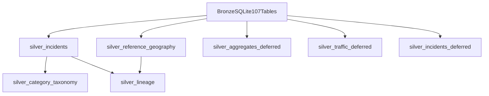

# Silver Normalization Plan

Generated: 2026-07-02T09:40:16.652Z

Bronze smoke test result: **PASS**  
Bronze database: `data/bronze/crimecanada-bronze.sqlite` (107 data tables, 6,886,703 rows)

## 1. Goals

Build a layered silver design that enables cross-jurisdiction incident queries for CrimeCanada.io **without** collapsing source semantics into one brittle universal schema for all 107 bronze tables.

Silver Step 4 will normalize **Phase 1 public incident sources** into `silver_incidents`, preserve full source payloads in `source_fields_json`, and keep aggregates, traffic, sensitive, and reference geography in separate deferred tables.

## 2. Layer model

| Layer | Bronze source classes | Silver target | Step 4 build |
|-------|----------------------|---------------|--------------|
| Public incidents | `public_incident_records*` | `silver_incidents` | Phase 1 |
| Reference geography | `reference_geography` | `silver_reference_geography` | Phase 2 |
| Aggregates / ASR / budget | `downloaded_report_archive`, benchmarks | `silver_aggregates_deferred` | Deferred |
| Traffic / KSI | `public_collision_records` | `silver_traffic_deferred` | Deferred |
| Sensitive / calls for service | sensitive TPS + crisis datasets | `silver_incidents_deferred` | Deferred |

## 3. Canonical incident tables

Total incident-class bronze tables: **31**

### Phase 1 (`19` tables — build first)

- `cat-0010` | tps | tps_major_crime_v1 | assault-open-data | 254,378 rows | `bronze__tps__tps_major_crime_v1__assault_open_data_4176353985444773481_cs`
- `cat-0011` | tps | tps_major_crime_v1 | auto-theft-open-data | 78,714 rows | `bronze__tps__tps_major_crime_v1__auto_theft_open_data_4481082360476864088`
- `cat-0013` | tps | tps_major_crime_v1 | break-and-enter-open-data | 84,689 rows | `bronze__tps__tps_major_crime_v1__break_and_enter_open_data_91987683163494`
- `cat-0061` | tps | tps_major_crime_v1 | robbery-open-data | 40,248 rows | `bronze__tps__tps_major_crime_v1__robbery_open_data_2226832258065309099_cs`
- `cat-0067` | tps | tps_major_crime_v1 | theft-from-motor-vehicle-open-data | 106,574 rows | `bronze__tps__tps_major_crime_v1__theft_from_motor_vehicle_open_data_46368`
- `cat-0068` | tps | tps_major_crime_v1 | theft-over-open-data | 16,790 rows | `bronze__tps__tps_major_crime_v1__theft_over_open_data_309556416197554984_`
- `cat-0075` | tps | tps_processed_v1 | Assault|Auto Theft|Break and Enter|Robbery|Theft From MV|Theft Over | 581,393 rows | `bronze__tps__tps_processed_v1__tps_v1_v2_sqlite`
- `cat-0076` | peel-prp | peel_ecrimes_incidents | ASL|VEH|FRA|MIS|BNE|DRP|ROB|DRT|HOM | 82,401 rows | `bronze__peel_prp__peel_ecrimes_incidents__peel_prp_ecrimes_2026_07_01_with_geometr`
- `cat-0090` | yrp | yrp_community_safety_incidents | occ_type | 67,153 rows | `bronze__yrp__yrp_community_safety_incidents__yrp_community_safety_occurrences_2026_07`
- `cat-0093` | durham-drps | durham_master | crime_category | 7,819 rows | `bronze__durham_drps__durham_master__durham_drps_avl_odp_crimemap_master_2026`
- `cat-0094` | durham-drps | durham_standalone_extract | crime_category | 16,157 rows | `bronze__durham_drps__durham_standalone_extract__durham_drps_assault_open_data_2026_07_01`
- `cat-0095` | durham-drps | durham_standalone_extract | crime_category | 6,411 rows | `bronze__durham_drps__durham_standalone_extract__durham_drps_auto_theft_open_data_2026_07`
- `cat-0096` | durham-drps | durham_standalone_extract | crime_category | 7,315 rows | `bronze__durham_drps__durham_standalone_extract__durham_drps_bne_open_data_2026_07_01_csv`
- `cat-0097` | durham-drps | durham_standalone_extract | crime_category | 3,698 rows | `bronze__durham_drps__durham_standalone_extract__durham_drps_drug_violations_open_data_20`
- `cat-0098` | durham-drps | durham_standalone_extract | crime_category | 258 rows | `bronze__durham_drps__durham_standalone_extract__durham_drps_firearm_shooting_open_data_2`
- `cat-0099` | durham-drps | durham_standalone_extract | crime_category | 1,538 rows | `bronze__durham_drps__durham_standalone_extract__durham_drps_robbery_open_data_2026_07_01`
- `cat-0100` | durham-drps | durham_standalone_extract | crime_category | 1,408 rows | `bronze__durham_drps__durham_standalone_extract__durham_drps_theft_over_5000_open_data_20`
- `cat-0105` | halton-hrps | halton_crime_map_incidents | DESCRIPTION | 20,252 rows | `bronze__halton_hrps__halton_crime_map_incidents__halton_hrps_crime_map_incidents_2026_07_`
- `cat-0108` | hamilton-hps | hamilton_communitycrimemap_hps_only | selected crimeTypes [1,6,7,10,11,16,17] | 21,367 rows | `bronze__hamilton_hps__hamilton_communitycrimemap_hps_only__hamilton_communitycrimemap_hps_only_2021`

### Deferred / QA-only (`12` tables)

- `cat-0012` | tps | tps_major_crime_v1 | deferred_review | 39,969 rows
- `cat-0031` | tps | tps_sensitive_incident | deferred_review | 2,041 rows
- `cat-0032` | tps | tps_sensitive_incident | deferred_review | 1,531 rows
- `cat-0033` | tps | tps_sensitive_incident | deferred_review | 1,531 rows
- `cat-0034` | tps | tps_sensitive_incident | deferred_review | 190,723 rows
- `cat-0037` | tps | tps_major_crime_combined | deferred_review | 474,819 rows
- `cat-0038` | tps | tps_sensitive_incident | deferred_review | 134,457 rows
- `cat-0049` | tps | tps_calls_for_service | deferred_review | 357,697 rows
- `cat-0063` | tps | tps_sensitive_incident | deferred_review | 6,829 rows
- `cat-0077` | peel-prp | peel_ecrimes_legacy | not_for_public_incident_map | 82,401 rows
- `cat-0106` | halton-hrps | halton_crime_map_incidents_geojson | source_disclaimer_required | 20,252 rows
- `cat-0107` | hamilton-hps | hamilton_communitycrimemap_raw | not_for_public_incident_map | 21,369 rows

## 4. Canonical column model

Primary table: `silver_incidents` (see `data/silver/SILVER_CANONICAL_COLUMNS.csv`).

Design principles:

1. Extend proven TPS V1 `incidents` shape from `scripts/process-tps-v1.mjs` with cross-jurisdiction geography and taxonomy fields.
2. Always retain `source_fields_json` and `bronze_table` for audit replay.
3. Never dedupe on `event_unique_id` for TPS; preserve Peel duplicate `OccurrenceNumber` rows.
4. Compute `mappable` consistently: valid lat/lng and exclude 0,0 coordinates.
5. Map raw offence labels to `category_canonical` / `category_family` via `SILVER_CATEGORY_TAXONOMY_DRAFT.csv`.

## 5. Source-column mapping

Full per-source mapping: `data/silver/SILVER_SOURCE_COLUMN_MAPPING.csv`.

Jurisdiction transform profiles:

| jurisdiction | occ_date | coordinates | offence | geography | special rules |
|--------------|----------|-------------|---------|-----------|---------------|
| tps | OCC_DATE | LAT_WGS84, LONG_WGS84 | OFFENCE, CSI_CATEGORY | DIVISION, HOOD_158 | no EVENT_UNIQUE_ID dedupe |
| peel-prp | OccDate | Latitude, Longitude | OccType, Description | Municipality, Division | preserve OccurrenceNumber duplicates |
| yrp | occ_date | latitude, longitude | occ_type, case_category1 | municipality, district | occ_id grouping |
| durham-drps | occ_date | latitude, longitude | crime_category | municipality, division | master + 7 standalone extracts |
| halton-hrps | OCC_DATE | LATITUDE, LONGITUDE | DESCRIPTION | CITY, LOCATION | CSV primary; geojson QA only |
| hamilton-hps | DateOfOccurrence | derived/null | Crime, UCRGroup | Agency, AddressOfCrime | HPS-only cleaned for public |

## 6. Category taxonomy

Draft taxonomy: `data/silver/SILVER_CATEGORY_TAXONOMY_DRAFT.csv`

Initial families from coverage matrix:

- assault, auto_vehicle_theft, theft_from_vehicle, break_and_enter, robbery
- homicide, shooting_firearm, sexual_assault, hate_crime, arson, drugs, fraud
- traffic_collisions (deferred traffic layer, not `silver_incidents` Phase 1)

Publish tiers:

- `v1_published` — TPS major crime v1 + cross-region crime-map sources approved for public map/table
- `v1_deferred` — loaded in bronze but withheld pending review (sensitive TPS, combined major crime, Hamilton raw)
- `reference_only` — taxonomy placeholders where source lacks explicit public category

## 7. Proposed silver database layout (Step 4)

Target file: `data/silver/crimecanada-silver.sqlite`

Tables:

- `silver_incidents`
- `silver_reference_geography`
- `silver_lineage`
- `silver_category_taxonomy`

**Do not apply indexes in Step 3.** Step 4 loader may add query indexes after initial load validation.

## 8. Normalization rules

1. **Dates** — parse catalog `date_field_used` to ISO `YYYY-MM-DD`; store unparsed values only inside `source_fields_json`.
2. **Coordinates** — cast to REAL; null invalid strings; `mappable=0` for missing or zero coordinates.
3. **Identity** — `silver_record_key = jurisdiction_id || ':' || catalog_id || ':' || source_record_id`.
4. **JSON preservation** — serialize all non-provenance bronze columns to `source_fields_json`.
5. **Lineage** — one `silver_lineage` row per source table with rows_in/out and transform profile.
6. **Halton dedupe policy** — load CSV table only; compare row counts against geojson sibling during Step 4 QA.
7. **Hamilton policy** — public silver uses `hamilton_communitycrimemap_hps_only`; keep raw table out of Phase 1 publish set.

## 9. Risks before building silver

1. **Category alignment** — jurisdictions use incompatible offence labels; taxonomy mapping will be lossy for fraud/drugs/multi-label Peel/YRP rows.
2. **Halton duplication** — CSV and GeoJSON produce parallel 20,252-row tables in bronze; silver must pick one primary source.
3. **Hamilton coordinates** — cleaned file may lack consistent lat/lng; map mappable counts may be low without geocoding.
4. **TPS duplicate event ids** — EVENT_UNIQUE_ID repeats across rows by design; incorrect dedupe would drop valid records.
5. **Durham standalone extracts vs master** — category slices may overlap master crime-map rows; need publish rules before merging views.
6. **Sensitive datasets in bronze** — hate crime, homicides duplicate files, mental health, IPV loaded for audit but must stay out of Phase 1 public silver.
7. **Build size** — Phase 1 incident row volume is ~1.1M+ rows before TPS processed v1; full normalization will be CPU/disk heavy.
8. **GeoJSON geometry** — bronze stores `_raw_geometry` as TEXT JSON; parsing cost and invalid geometry handling needed in Step 4.

## 10. Step 4 exit criteria

Step 4 is complete when:

1. `scripts/load-silver-database.mjs` loads Phase 1 incident tables into `data/silver/crimecanada-silver.sqlite`
2. `data/silver/silver-load-manifest.json` reports row counts and 0 hard errors
3. Phase 1 row totals match bronze smoke expectations for each source
4. `silver_lineage` and `silver_category_taxonomy` populated
5. Spot checks pass for TPS assault, Peel, YRP, Durham master, Halton CSV, Hamilton HPS-only

## 11. Exact next request

> Build Step 4: create `scripts/load-silver-database.mjs`, load Phase 1 incident sources into `data/silver/crimecanada-silver.sqlite`, produce `data/silver/silver-load-manifest.json`, and run silver QA spot checks. Do not modify app code.
