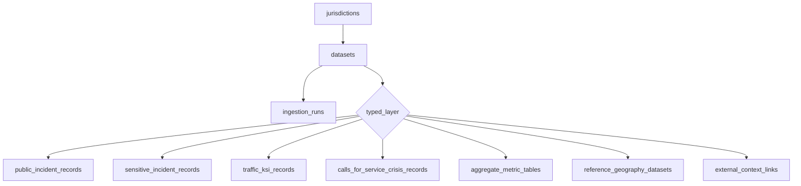

# CrimeCanada.io — Product / UI Architecture (2026-06-30)

Companion to the UI foundation pass. Describes the data and UI-state models the
interface is designed around. This is **design intent**, not a built database:
V1 ships static/preview data and styled scaffolds. No Prisma schema, migrations,
ingestion, auth, billing, or AI backend are created in this pass.

See also: [NORTH_STAR.md](./NORTH_STAR.md), [DATA_SOURCE_PLAN.md](./DATA_SOURCE_PLAN.md),
[LEGAL_GUARDRAILS.md](./LEGAL_GUARDRAILS.md),
[TPS_TYPED_SOURCE_LAYER_PLAN_2026-06-30.md](./TPS_TYPED_SOURCE_LAYER_PLAN_2026-06-30.md).

> Honesty note: where the UI shows numbers derived from synthetic preview data
> (`src/lib/mockIncidents.ts`), it is labelled "Preview · not live data." Only
> dataset-level row counts (from the committed inventory) are factual today.

---

## 1. Unified source foundation

One federated foundation, many typed layers. The full TPS corpus is preserved
and classified; public features are released layer by layer. A "single organism"
means a **federated, provenance-aware system**, never one undifferentiated table.



Shared metadata (`jurisdictions`, `datasets`, `ingestion_runs`) is common across
layers; each layer keeps its own record schema.

Current code surface: `src/lib/datasets.ts`, `src/lib/layers.ts`.

---

## 2. Jurisdiction model

```ts
jurisdiction {
  id              // e.g. "toronto-tps"
  city, province
  agency          // "Toronto Police Service"
  status          // active | planned | researching | not_started
  priority        // acquisition order; 0 = live
}
```

V1 has exactly one `active` jurisdiction (Toronto/TPS). Future cities
(Calgary, Peel, Edmonton, Vancouver, Winnipeg, StatsCan) exist only as future
nodes with a readiness status and **no data**. Code: `src/lib/jurisdictions.ts`,
surfaced on `/canada`.

---

## 3. Dataset metadata model

One row per source file/dataset. Every dataset carries full provenance.

```ts
dataset {
  slug                 // stable, e.g. "assault-open-data"
  name                 // official TPS title
  jurisdiction_id
  typed_layer          // one of the seven layers
  publish_status       // v1_published | deferred | reference_only
  source_url
  licence_name, licence_url
  dataset_update_date  // as published by TPS
  ingestion_timestamp
  row_count            // factual (inventory)
  non_mappable_count   // rows at 0,0 (factual)
  provenance_status    // to_be_confirmed | verified
}
```

Six datasets are `v1_published`; all others `deferred`/`reference_only`. Code:
`src/lib/datasets.ts`. Provenance URLs/dates are placeholders flagged
`to_be_confirmed` until ingestion; the UI says so via `SourceReceipt`.

---

## 4. Ingestion run model

Audit trail per ingest attempt (Phase 3+; not built this pass).

```ts
ingestion_run {
  id
  dataset_id
  started_at, finished_at
  status               // success | partial | failed
  file_checksum_sha256
  record_count
  error_count
  notes                // transforms, anomalies, TPS changelog
}
```

Ingestion is idempotent; a new TPS download creates a new dated archive + a new
run, and updates `dataset_update_date` shown in the UI.

---

## 5. V1 `public_incident_records` model

Layer-specific schema for the six Major Crime datasets (not shared with other
layers). Field names mirror the 31-column family.

```ts
public_incident_record {
  source_record_id     // OBJECTID (unique within file)
  event_unique_id      // stored; NOT used for dedupe (not unique)
  dataset_id
  offence, csi_category
  report_date, occ_date
  occ_year, occ_month, occ_dow, occ_hour
  division
  premises_type, location_type
  hood_158, neighbourhood_158        // primary
  hood_140, neighbourhood_140        // legacy, preserved
  lat_wgs84, lng_wgs84               // 0,0 => excluded from map markers only
  source_fields_json                 // full original row
  // provenance via dataset_id join: source_url, licence_url, update/ingestion dates
}
```

Rules: `OBJECTID → source_record_id`; `EVENT_UNIQUE_ID` stored but never used to
deduplicate; `HOOD_158`/`NEIGHBOURHOOD_158` primary; all original columns kept in
`source_fields_json`; `0,0` rows stay in table/search, excluded from map markers.
Preview shape: `src/lib/mockIncidents.ts` (`PreviewIncident`).

---

## 6. Future typed layers

Distinct schemas, released later under legal/presentation review:

| Layer | Status | Notes |
|-------|--------|-------|
| `sensitive_incident_records` | deferred | Homicides, shootings, hate crime, IPV, MHA apprehensions |
| `traffic_ksi_records` | deferred | 54-col KSI participant schema; Traffic Collisions |
| `calls_for_service_crisis_records` | deferred | Persons in Crisis; `EVENT_ID`, no WGS84 |
| `aggregate_metric_tables` | deferred | ASR, budgets, FIRS, RBDC, neighbourhood rates |
| `reference_geography_datasets` | reference_only | Divisions, patrol zones, facilities |

Code: `src/lib/layers.ts`, surfaced on `/data/layers` and `/vision`.

---

## 7. Future CrimeInToronto context model

A separate, post-V1 layer. Never blended into official TPS data.

```ts
external_context_link {
  id
  incident_ref          // soft link to a public_incident_record (optional)
  jurisdiction_id
  source_name           // e.g. "CrimeInToronto.com"
  source_url
  relationship_type     // related_reporting | follow_up | context
  link_confidence       // 0..1
  review_status         // pending | approved | rejected
  label                 // "External context — not part of TPS source data"
}
```

UI intent: a "Related reporting/context" panel beside the official record panel,
always badged as external, never implying guilt or identifying people beyond
public/editorial boundaries. 0 article records today.

---

## 8. Future city onboarding model

Adding a city is a data operation, not a code fork:

1. Document official source URL + licence + field audit in `DATA_SOURCE_PLAN`.
2. Create a `jurisdiction` row (e.g. `calgary-police`).
3. Archive raw files under `data/raw/{agency-slug}/{dataset-slug}/{YYYY-MM-DD}/`.
4. Classify each dataset into a typed layer.
5. Track each ingest via `ingestion_runs` with full provenance.
6. Expose a city/region selector only once a second source is production-ready.
7. Never mix sources without per-record attribution; never scrape unofficial sites.

The UI is built so a city selector can appear naturally; until then no fabricated
city data is shown.

---

## 9. AI query / citation model

The AI co-pilot (post-V1) is structured, not free-form.

```ts
ai_answer {
  interpreted_query     // human-readable restatement
  filters: ExplorerFilters
  result_count          // from a real query only
  views: ["map","table","chart"]
  source_receipt {      // datasets, agency, update/ingestion dates, filters, count
    datasets[], record_count, reproducible_url
  }
  limitations: string[]
  refusal?: { reason }  // safety/people/unsupported => refuse
}
```

Hard rules: cite datasets, filters, and counts; link a reproducible explorer URL;
say "reported incidents" not "confirmed crimes"; never invent statistics; refuse
safety recommendations and people/name/profile queries. Concept surface: `/ai`
(`AiQueryBar` + structured answer card). It does not answer in V1.

---

## 10. UI state / filter URL model

Shared, URL-encoded filter state is the single source of truth across map,
table, and search — and the basis of every "reproducible URL" in `SourceReceipt`.

```ts
ExplorerFilters {
  offence: string[]     // dataset slugs;  ?offence=assault-open-data,robbery-open-data
  dateFrom?, dateTo?    // ?from=YYYY-MM-DD&to=YYYY-MM-DD
  neighbourhood?        // HOOD_158;       ?hood=131
  division?             // ?div=D51
  geocodable            // any | yes | no;  ?geo=yes
}
```

Code: `src/lib/filters.ts` (`parseFilters`, `toQueryString`, `buildExplorerUrl`,
`describeFilters`). No free-text person search exists. Pages read `searchParams`
(async in Next 16) and hydrate the same filter object the components emit.

---

## Component ↔ model map

| Component | Backing model |
|-----------|---------------|
| `SourceReceipt` | dataset metadata + ingestion run + filter state |
| `DatasetBadge` / `DataLayerStack` | typed layers |
| `FilterBar` / `ExplorerShell` | UI filter URL model |
| `MapPreview` / `DataTablePreview` | `public_incident_records` (preview shape) |
| `AiQueryBar` + answer card | AI query/citation model |
| `/canada` node map | jurisdiction model |

---

## Related documents

- [NORTH_STAR.md](./NORTH_STAR.md)
- [FINAL_PRODUCT_SPEC.md](./FINAL_PRODUCT_SPEC.md)
- [DATA_SOURCE_PLAN.md](./DATA_SOURCE_PLAN.md)
- [IMPLEMENTATION_PLAN.md](./IMPLEMENTATION_PLAN.md)
- [LEGAL_GUARDRAILS.md](./LEGAL_GUARDRAILS.md)
- [TPS_TYPED_SOURCE_LAYER_PLAN_2026-06-30.md](./TPS_TYPED_SOURCE_LAYER_PLAN_2026-06-30.md)
