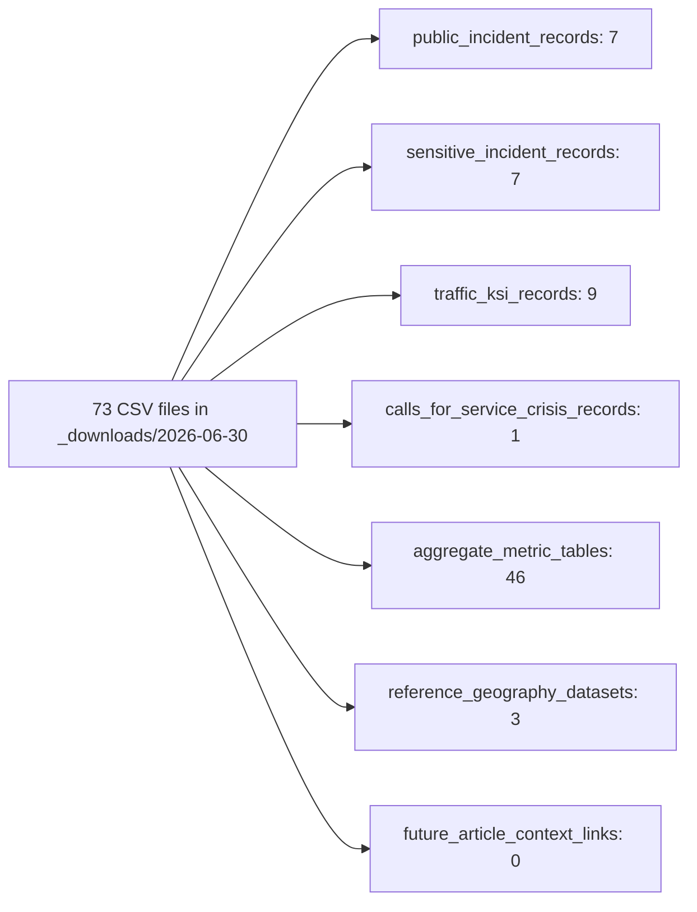

# TPS Typed Source Layer Plan — 2026-06-30

Manifest-only classification for all TPS CSV files in the 2026-06-30 bulk download. Assigns each file to exactly one typed source layer, a logical dataset slug, a publish status, and a proposed canonical archive path. **No files were moved, copied, renamed, edited, or deleted.**

> **No file operations performed.** This document is a classification manifest only. All 73 CSV files remain unmodified in `data/raw/tps/_downloads/2026-06-30/`.

**Source of truth:**

- [TPS_RAW_DATA_INVENTORY_2026-06-30.md](./TPS_RAW_DATA_INVENTORY_2026-06-30.md) — structural inventory (73 files, schema families, duplicate pairs)
- [DATA_SOURCE_PLAN.md](./DATA_SOURCE_PLAN.md) — typed layers, V1 six-file family, slug/archive conventions
- [IMPLEMENTATION_PLAN.md](./IMPLEMENTATION_PLAN.md) — Phase 2: classify without modifying originals (satisfied by this manifest)

**Bulk source path:** `data/raw/tps/_downloads/2026-06-30/`

---

## Typed source layers

Each TPS dataset is assigned exactly one typed layer. Layers have different schema boundaries; do not merge into a single universal incident table.

| Layer | Description | Files in this download |
|-------|-------------|------------------------:|
| `public_incident_records` | Standard geocoded incident open data for public search, table, and map | 7 |
| `sensitive_incident_records` | Incident data requiring additional legal or presentation review | 7 |
| `traffic_ksi_records` | Traffic collisions and KSI participant-level records | 9 |
| `calls_for_service_crisis_records` | Crisis and mental-health-related calls-for-service | 1 |
| `aggregate_metric_tables` | Annual reports, budgets, FIRS, RBDC, and count/summary tables | 46 |
| `reference_geography_datasets` | Division boundaries, patrol zones, facilities, reference geometry | 3 |
| `future_article_context_links` | Future CrimeInToronto article or micro-data links | 0 |



---

## Publish status vocabulary

| Status | Meaning | Copy to canonical later? |
|--------|---------|--------------------------|
| `v1_published` | V1 public UI ingestion target (six Major Crime files) | **Yes** (priority) |
| `deferred` | Preserved and classified; post-V1 ingest candidate | **Yes** |
| `reference_only` | Geography/reference support layers; not incident data | **Yes** |
| `duplicate_review` | Bulk-download duplicate or ambiguous twin; pick canonical before archive | **No** (until resolved) |
| `excluded_from_v1` | Not in V1 scope; reserved for non-canonical copies after duplicate review | **No** |

**Classification rule:** Primary dataset copies receive `v1_published`, `deferred`, or `reference_only`. Secondary `(1)` copies and ambiguous Budget 2024 twins receive `duplicate_review`. After review, non-canonical byte-identical copies may be reclassified `excluded_from_v1` in a future manifest revision.

---

## V1 Major Crime Open Data (six files)

V1 public UI is powered by **six offence-specific datasets** sharing the **31-column Major Crime schema** documented in the inventory. These are the only files with `publish_status: v1_published`.

| Official dataset | Original filename | Dataset slug | Proposed canonical path |
|------------------|-------------------|--------------|-------------------------|
| Assault Open Data | `Assault_Open_Data_4176353985444773481.csv` | `assault-open-data` | `data/raw/tps/assault-open-data/2026-06-30/` |
| Auto Theft Open Data | `Auto_Theft_Open_Data_4481082360476864088.csv` | `auto-theft-open-data` | `data/raw/tps/auto-theft-open-data/2026-06-30/` |
| Break and Enter Open Data | `Break_and_Enter_Open_Data_9198768316349412680.csv` | `break-and-enter-open-data` | `data/raw/tps/break-and-enter-open-data/2026-06-30/` |
| Robbery Open Data | `Robbery_Open_Data_2226832258065309099.csv` | `robbery-open-data` | `data/raw/tps/robbery-open-data/2026-06-30/` |
| Theft From Motor Vehicle Open Data | `Theft_From_Motor_Vehicle_Open_Data_4636805822324249695.csv` | `theft-from-motor-vehicle-open-data` | `data/raw/tps/theft-from-motor-vehicle-open-data/2026-06-30/` |
| Theft Over Open Data | `Theft_Over_Open_Data_-309556416197554984.csv` | `theft-over-open-data` | `data/raw/tps/theft-over-open-data/2026-06-30/` |

**Shared schema (31 columns):** `OBJECTID`, `EVENT_UNIQUE_ID`, `REPORT_DATE`, `OCC_DATE`, `REPORT_YEAR`, `REPORT_MONTH`, `REPORT_DAY`, `REPORT_DOY`, `REPORT_DOW`, `REPORT_HOUR`, `OCC_YEAR`, `OCC_MONTH`, `OCC_DAY`, `OCC_DOY`, `OCC_DOW`, `OCC_HOUR`, `DIVISION`, `LOCATION_TYPE`, `PREMISES_TYPE`, `UCR_CODE`, `UCR_EXT`, `OFFENCE`, `CSI_CATEGORY`, `HOOD_158`, `NEIGHBOURHOOD_158`, `HOOD_140`, `NEIGHBOURHOOD_140`, `LONG_WGS84`, `LAT_WGS84`, `x`, `y`

**V1 normalization notes (from inventory):** `OBJECTID` is unique within each file; `EVENT_UNIQUE_ID` is stored but **not used for deduplication** (not unique in Major Crime files); primary neighbourhood filters use `HOOD_158` / `NEIGHBOURHOOD_158`; rows with `LAT_WGS84 = 0` and `LONG_WGS84 = 0` remain in table/search but are excluded from map markers.

---

## Duplicate review required

Four files in three groups need review before canonical organization. Do not copy `duplicate_review` files until resolved.

### 1. Traffic Collisions Open Data (byte-identical pair)

| File | Size | Rows | Publish status | Copy later? |
|------|------|------|----------------|-------------|
| `Traffic_Collisions_Open_Data_8128730402587031536.csv` | 145.86 MB | 809,034 | `deferred` (primary candidate) | yes |
| `Traffic_Collisions_Open_Data_8128730402587031536 (1).csv` | 145.86 MB | 809,034 | `duplicate_review` | no |

**Action:** SHA-256 compare; if identical, copy one file to `data/raw/tps/traffic-collisions-open-data/2026-06-30/` and reclassify the non-canonical copy as `excluded_from_v1`.

### 2. Homicides Open Data (byte-identical pair)

| File | Size | Publish status | Copy later? |
|------|------|----------------|-------------|
| `Homicides_Open_Data_ASR_RC_TBL_002_8369086210015881422.csv` | 304.3 KB | `deferred` (primary candidate) | yes |
| `Homicides_Open_Data_ASR_RC_TBL_002_8369086210015881422 (1).csv` | 304.3 KB | `duplicate_review` | no |

**Action:** SHA-256 compare; if identical, copy one file to `data/raw/tps/homicides-open-data/2026-06-30/`.

### 3. Budget 2024 (content-ambiguous pair)

| File | Size | Rows | Publish status | Copy later? |
|------|------|------|----------------|-------------|
| `Budget_2024.csv` | 1.33 MB | 7,689 | `duplicate_review` | after_duplicate_review |
| `Budget_2024 (1).csv` | 3.03 MB | 16,266 | `duplicate_review` | after_duplicate_review |

**Reason:** Two distinct Budget 2024 exports in the bulk download (different row counts; not listed as byte-identical in inventory). Determine which export (or both, under variant slugs) represents the intended canonical budget before archive under `budget-2024/2026-06-30/`.

---

## Full classification manifest (73 files)

| # | Original filename | Detected dataset name | Typed source layer | Dataset slug | Publish status | Classification reason | Copy to canonical later? |
|---|-------------------|----------------------|--------------------|--------------|----------------|----------------------|--------------------------|
| 1 | `2008_FIRS_-2679553021179060779.csv` | 2008 FIRS | `aggregate_metric_tables` | `firs-2008` | `deferred` | FIRS contact records (15 columns, `CONTACTID`); historical aggregate, not geocoded incidents | yes |
| 2 | `2009_FIRS_-5907723437875695368.csv` | 2009 FIRS | `aggregate_metric_tables` | `firs-2009` | `deferred` | FIRS contact records; annual summary/contact dataset, no event-level map coordinates | yes |
| 3 | `2010_FIRS_-2517232609472490769.csv` | 2010 FIRS | `aggregate_metric_tables` | `firs-2010` | `deferred` | FIRS contact records; preserved for historical analysis, not V1 explorer schema | yes |
| 4 | `2011_FIRS_-4422831101139071978.csv` | 2011 FIRS | `aggregate_metric_tables` | `firs-2011` | `deferred` | FIRS contact records; aggregate contact log without WGS84 incident coordinates | yes |
| 5 | `2012_FIRS_7370968145260043353.csv` | 2012 FIRS | `aggregate_metric_tables` | `firs-2012` | `deferred` | FIRS contact records; summary/contact table deferred from V1 public UI | yes |
| 6 | `2013_FIRS_8501434035380412761.csv` | 2013 FIRS | `aggregate_metric_tables` | `firs-2013` | `deferred` | FIRS contact records; last FIRS year in corpus; aggregate layer only | yes |
| 7 | `Administrative_(ASR_AD_TBL_001)_1478935144902378667.csv` | Administrative (ASR AD TBL 001) | `aggregate_metric_tables` | `asr-administrative` | `deferred` | ASR annual report count table; no event identifiers or geocoded incidents | yes |
| 8 | `Arrested_and_Charged_Persons_(ASR_ENF_TBL_001)_548544473732615405.csv` | Arrested and Charged Persons (ASR ENF TBL 001) | `aggregate_metric_tables` | `asr-arrested-and-charged-persons` | `deferred` | ASR enforcement summary counts by year/category; not incident-level open data | yes |
| 9 | `Assault_Open_Data_4176353985444773481.csv` | Assault Open Data | `public_incident_records` | `assault-open-data` | `v1_published` | 31-column Major Crime family; V1 public explorer target with WGS84 coordinates | yes |
| 10 | `Auto_Theft_Open_Data_4481082360476864088.csv` | Auto Theft Open Data | `public_incident_records` | `auto-theft-open-data` | `v1_published` | 31-column Major Crime family; V1 public explorer target | yes |
| 11 | `AUTOMOBILE_KSI_-3713167661214258977.csv` | AUTOMOBILE KSI | `traffic_ksi_records` | `automobile-ksi` | `deferred` | 54-column KSI participant-level collision data; distinct schema from public incident layer | yes |
| 12 | `Bicycle_Thefts_Open_Data_-8919999175893776292.csv` | Bicycle Thefts Open Data | `public_incident_records` | `bicycle-thefts-open-data` | `deferred` | Incident open data (35-column variant with bike attributes); deferred from V1 pending public/sensitive layer decision per DATA_SOURCE_PLAN | yes |
| 13 | `Break_and_Enter_Open_Data_9198768316349412680.csv` | Break and Enter Open Data | `public_incident_records` | `break-and-enter-open-data` | `v1_published` | 31-column Major Crime family; V1 public explorer target | yes |
| 14 | `Budget_2020_8087021416505284746.csv` | Budget 2020 | `aggregate_metric_tables` | `budget-2020` | `deferred` | Budget line items (12 columns); financial aggregate, not incident records | yes |
| 15 | `Budget_2021_2456030383083920061.csv` | Budget 2021 | `aggregate_metric_tables` | `budget-2021` | `deferred` | Budget line items; organizational cost summary table | yes |
| 16 | `Budget_2022_-2655320733178210418.csv` | Budget 2022 | `aggregate_metric_tables` | `budget-2022` | `deferred` | Budget line items; deferred aggregate metric layer | yes |
| 17 | `Budget_2023_1284559222086023539.csv` | Budget 2023 | `aggregate_metric_tables` | `budget-2023` | `deferred` | Budget line items; no geocoded incident rows | yes |
| 18 | `Budget_2024 (1).csv` | Budget | `aggregate_metric_tables` | `budget-2024` | `duplicate_review` | Budget 2024 export (16,266 rows); ambiguous twin—resolve before canonical copy | after_duplicate_review |
| 19 | `Budget_2024.csv` | Budget | `aggregate_metric_tables` | `budget-2024` | `duplicate_review` | Budget 2024 export (7,689 rows); ambiguous twin—resolve before canonical copy | after_duplicate_review |
| 20 | `Budget_2025.csv` | Budget | `aggregate_metric_tables` | `budget-2025` | `deferred` | Budget line items (2025 fiscal year); aggregate metric table | yes |
| 21 | `Budget_2026.csv` | Budget | `aggregate_metric_tables` | `budget-2026` | `deferred` | Budget line items (2026 fiscal year); aggregate metric table | yes |
| 22 | `Budget_by_Command.csv` | Budget by Command | `aggregate_metric_tables` | `budget-by-command` | `deferred` | Command-level budget summary; referenced in DATA_SOURCE_PLAN aggregate layer | yes |
| 23 | `Calls_for_Service_Attended_(ASR_CS_TBL_003)_8360330772672605309.csv` | Calls for Service Attended (ASR CS TBL 003) | `aggregate_metric_tables` | `asr-calls-for-service-attended` | `deferred` | ASR calls-for-service count table; summary metrics without event-level coordinates | yes |
| 24 | `Complaint_Dispositions_(ASR_PCF_TBL_003)_-5877412472568242550.csv` | Complaint Dispositions (ASR PCF TBL 003) | `aggregate_metric_tables` | `asr-complaint-dispositions` | `deferred` | ASR public complaints disposition counts; aggregate table | yes |
| 25 | `CYCLIST_KSI_6778972150312286022.csv` | CYCLIST KSI | `traffic_ksi_records` | `cyclist-ksi` | `deferred` | 54-column KSI participant records; collision domain separate from Major Crime | yes |
| 26 | `Dispatched_Calls_by_Division_(ASR_CS_TBL_001)_-2648219355645136891.csv` | Dispatched Calls by Division (ASR CS TBL 001) | `aggregate_metric_tables` | `asr-dispatched-calls-by-division` | `deferred` | Division-level dispatched call counts; ASR aggregate | yes |
| 27 | `FATALS_KSI_1591277964987434465.csv` | FATALS KSI | `traffic_ksi_records` | `fatals-ksi` | `deferred` | 54-column KSI participant records; traffic/collision layer | yes |
| 28 | `Firearms_Top_Calibres_(ASR_F_TBL_001)_-5421012277072395013.csv` | Firearms Top Calibres (ASR F TBL 001) | `aggregate_metric_tables` | `asr-firearms-top-calibres` | `deferred` | ASR firearms summary counts; no geocoded incidents | yes |
| 29 | `Gross_Expenditures_by_Division_(ASR_PB_TBL_001)_3825889777885479982.csv` | Gross Expenditures by Division (ASR PB TBL 001) | `aggregate_metric_tables` | `asr-gross-expenditures-by-division` | `deferred` | ASR personnel/budget division expenditure summary | yes |
| 30 | `Gross_Operating_Budget_(ASR_PB_TBL_005)_-1923772532052292360.csv` | Gross Operating Budget (ASR PB TBL 005) | `aggregate_metric_tables` | `asr-gross-operating-budget` | `deferred` | ASR gross operating budget totals; aggregate metric | yes |
| 31 | `HATE_CRIME_OPEN_DATA_-1768225117781365955.csv` | HATE CRIME OPEN DATA | `sensitive_incident_records` | `hate-crime-open-data` | `deferred` | Sensitive incident open data; legal/presentation review required; no WGS84 lat/lng in source | yes |
| 32 | `Homicides_Open_Data_ASR_RC_TBL_002_8369086210015881422 (1).csv` | Homicides Open Data ASR RC TBL 002 | `sensitive_incident_records` | `homicides-open-data` | `duplicate_review` | Duplicate bulk-download copy (304.3 KB); SHA-256 review required before canonical archive | no |
| 33 | `Homicides_Open_Data_ASR_RC_TBL_002_8369086210015881422.csv` | Homicides Open Data ASR RC TBL 002 | `sensitive_incident_records` | `homicides-open-data` | `deferred` | Sensitive incident data with WGS84; deferred pending legal/presentation review | yes |
| 34 | `Intimate_Partner_and_Family_Violence_open_data_-3830886989670353627.csv` | Intimate Partner and Family Violence open data | `sensitive_incident_records` | `intimate-partner-and-family-violence-open-data` | `deferred` | Sensitive domestic/family violence data; no WGS84; classified per DATA_SOURCE_PLAN (not aggregate layer) | yes |
| 35 | `Investigated_Alleged_Misconduct_(ASR_PCF_TBL_002)_-2085696945410791167.csv` | Investigated Alleged Misconduct (ASR PCF TBL 002) | `aggregate_metric_tables` | `asr-investigated-alleged-misconduct` | `deferred` | ASR misconduct complaint counts; summary table | yes |
| 36 | `Mental_Health_Act_Apprehensions_Open_Data_6462585705434383286.csv` | Mental Health Act Apprehensions Open Data | `sensitive_incident_records` | `mental-health-act-apprehensions-open-data` | `deferred` | Sensitive mental-health apprehension incidents; no WGS84 coordinates; deferred from V1 | yes |
| 37 | `Miscellaneous_Calls_for_Service_(ASR_CS_TBL_002)_-4714122475863368795.csv` | Miscellaneous Calls for Service (ASR CS TBL 002) | `aggregate_metric_tables` | `asr-miscellaneous-calls-for-service` | `deferred` | ASR miscellaneous calls summary counts | yes |
| 38 | `Miscellaneous_Data_(ASR_MISC_TBL_001)_2360693627772460444.csv` | Miscellaneous Data (ASR MISC TBL 001) | `aggregate_metric_tables` | `asr-miscellaneous-data` | `deferred` | ASR miscellaneous aggregate data table | yes |
| 39 | `Miscellaneous_Firearms_(ASR_F_TBL_003)_5714712306071097312.csv` | Miscellaneous Firearms (ASR F TBL 003) | `aggregate_metric_tables` | `asr-miscellaneous-firearms` | `deferred` | ASR firearms miscellaneous counts | yes |
| 40 | `MOTORCYCLIST_KSI_5609304537475892552.csv` | MOTORCYCLIST KSI | `traffic_ksi_records` | `motorcyclist-ksi` | `deferred` | 54-column KSI participant records | yes |
| 41 | `Neighbourhood_Crime_Rates_Open_Data_5187007239983414201.csv` | Neighbourhood Crime Rates Open Data | `aggregate_metric_tables` | `neighbourhood-crime-rates-open-data` | `deferred` | 222-column neighbourhood rate matrix; summary metrics, not event-level incidents | yes |
| 42 | `PASSENGER_KSI_3578422465060491855.csv` | PASSENGER KSI | `traffic_ksi_records` | `passenger-ksi` | `deferred` | 54-column KSI participant records | yes |
| 43 | `Patrol_Zone_-3288783031102167883.csv` | Patrol Zone | `reference_geography_datasets` | `patrol-zone` | `reference_only` | Patrol zone reference/geometry layer for future map context; not incident data | yes |
| 44 | `PEDESTRIAN_KSI_3654470648591023106.csv` | PEDESTRIAN KSI | `traffic_ksi_records` | `pedestrian-ksi` | `deferred` | 54-column KSI participant records | yes |
| 45 | `Personnel_by_Command_(ASR_PB_TBL_004)_8734482224623258744.csv` | Personnel by Command (ASR PB TBL 004) | `aggregate_metric_tables` | `asr-personnel-by-command` | `deferred` | ASR staffing counts by command; aggregate metric | yes |
| 46 | `Personnel_by_Rank_(ASR_PB_TBL_002)_4327912300163850055.csv` | Personnel by Rank (ASR PB TBL 002) | `aggregate_metric_tables` | `asr-personnel-by-rank` | `deferred` | ASR personnel counts by rank | yes |
| 47 | `Personnel_by_Rank_by_Division_(ASR_PB_TBL_003)_5370263291996234710.csv` | Personnel by Rank by Division (ASR PB TBL 003) | `aggregate_metric_tables` | `asr-personnel-by-rank-by-division` | `deferred` | ASR personnel counts by rank and division | yes |
| 48 | `Persons_in_Crisis_Calls_for_Service_Attended_Open_Data_-3877229567131500534.csv` | Persons in Crisis Calls for Service Attended Open Data | `calls_for_service_crisis_records` | `persons-in-crisis-calls-for-service-attended-open-data` | `deferred` | Crisis calls-for-service domain; uses `EVENT_ID` (unique); no WGS84 lat/lng | yes |
| 49 | `Police_Facilities_6911054687584621728.csv` | Police Facilities | `reference_geography_datasets` | `police-facilities` | `reference_only` | Police facility locations (LATITUDE/LONGITUDE); reference layer for map context | yes |
| 50 | `RBDC_ARR_TBL_001_4032986751229720343.csv` | RBDC ARR TBL 001 | `aggregate_metric_tables` | `rbdc-arr-tbl-001` | `deferred` | RBDC arrest summary table; aggregate metric with `PersonID` identifier | yes |
| 51 | `RBDC_UOF_TBL_001_8718036773732049598.csv` | RBDC UOF TBL 001 | `aggregate_metric_tables` | `rbdc-uof-tbl-001` | `deferred` | RBDC use-of-force summary table | yes |
| 52 | `RBDC_UOF_TBL_002_2114656744363348377.csv` | RBDC UOF TBL 002 | `aggregate_metric_tables` | `rbdc-uof-tbl-002` | `deferred` | RBDC use-of-force summary table | yes |
| 53 | `RBDC_UOF_TBL_003_7983536065313291159.csv` | RBDC UOF TBL 003 | `aggregate_metric_tables` | `rbdc-uof-tbl-003` | `deferred` | RBDC use-of-force summary table | yes |
| 54 | `RBDC_UOF_TBL_004_-3558409208154542082.csv` | RBDC UOF TBL 004 | `aggregate_metric_tables` | `rbdc-uof-tbl-004` | `deferred` | RBDC use-of-force summary table | yes |
| 55 | `RBDC_UOF_TBL_005_1242716001725294161.csv` | RBDC UOF TBL 005 | `aggregate_metric_tables` | `rbdc-uof-tbl-005` | `deferred` | RBDC use-of-force summary table | yes |
| 56 | `RBDC_UOF_TBL_006_4119402934590759753.csv` | RBDC UOF TBL 006 | `aggregate_metric_tables` | `rbdc-uof-tbl-006` | `deferred` | RBDC use-of-force summary table | yes |
| 57 | `RBDC_UOF_TBL_007_8618837934118874435.csv` | RBDC UOF TBL 007 | `aggregate_metric_tables` | `rbdc-uof-tbl-007` | `deferred` | RBDC use-of-force summary table | yes |
| 58 | `Regulated_Interactions_(ASR_RI_TBL_001)_3915709414202984778.csv` | Regulated Interactions (ASR RI TBL 001) | `aggregate_metric_tables` | `asr-regulated-interactions` | `deferred` | ASR regulated interactions count table | yes |
| 59 | `Reported_Crimes_(ASR_RC_TBL_001)_-3089647980937589388.csv` | Reported Crimes (ASR RC TBL 001) | `aggregate_metric_tables` | `asr-reported-crimes` | `deferred` | ASR reported crime counts by category/year; aggregate summary | yes |
| 60 | `Robbery_Open_Data_2226832258065309099.csv` | Robbery Open Data | `public_incident_records` | `robbery-open-data` | `v1_published` | 31-column Major Crime family; V1 public explorer target | yes |
| 61 | `Search_of_Persons_(ASR_SP_TBL_001)_4815884241870621834.csv` | Search of Persons (ASR SP TBL 001) | `aggregate_metric_tables` | `asr-search-of-persons` | `deferred` | ASR search-of-persons count table | yes |
| 62 | `Shooting_and_Firearm_Discharges_Open_Data_-3025367010736391071.csv` | Shooting and Firearm Discharges Open Data | `sensitive_incident_records` | `shooting-and-firearm-discharges-open-data` | `deferred` | Sensitive firearm discharge incidents; WGS84 present; deferred pending legal review | yes |
| 63 | `Staffing_by_Command.csv` | Staffing by Command | `aggregate_metric_tables` | `staffing-by-command` | `deferred` | Command-level staffing summary; referenced in DATA_SOURCE_PLAN aggregate layer | yes |
| 64 | `Theft_From_Motor_Vehicle_Open_Data_4636805822324249695.csv` | Theft From Motor Vehicle Open Data | `public_incident_records` | `theft-from-motor-vehicle-open-data` | `v1_published` | 31-column Major Crime family; V1 public explorer target | yes |
| 65 | `Theft_Over_Open_Data_-309556416197554984.csv` | Theft Over Open Data | `public_incident_records` | `theft-over-open-data` | `v1_published` | 31-column Major Crime family; V1 public explorer target | yes |
| 66 | `Tickets_Issued_(ASR_ENF_TBL_002)_6312647708442498473.csv` | Tickets Issued (ASR ENF TBL 002) | `aggregate_metric_tables` | `asr-tickets-issued` | `deferred` | ASR enforcement ticket counts | yes |
| 67 | `Top_20_Offences_of_Firearm_Seizures_(ASR_F_TBL_002)_3169920589327387274.csv` | Top 20 Offences of Firearm Seizures (ASR F TBL 002) | `aggregate_metric_tables` | `asr-top-20-offences-firearm-seizures` | `deferred` | ASR top firearm seizure offence counts | yes |
| 68 | `TOTAL_KSI_4115794401574937330.csv` | TOTAL KSI | `traffic_ksi_records` | `total-ksi` | `deferred` | 54-column KSI participant records; combined collision participant layer | yes |
| 69 | `Total_Public_Complaints(ASR_PCF_TBL_001)_-5426935284038049601.csv` | Total Public Complaints(ASR PCF TBL 001) | `aggregate_metric_tables` | `asr-total-public-complaints` | `deferred` | ASR public complaint count summary | yes |
| 70 | `TPS_POLICE_DIVISIONS_-3160015003731132608.csv` | TPS POLICE DIVISIONS | `reference_geography_datasets` | `tps-police-divisions` | `reference_only` | Police division boundary/reference layer (16 rows); supports future map context | yes |
| 71 | `Traffic_Collisions_Open_Data_8128730402587031536 (1).csv` | Traffic Collisions Open Data | `traffic_ksi_records` | `traffic-collisions-open-data` | `duplicate_review` | Duplicate bulk-download copy (145.86 MB, 809,034 rows); SHA-256 review required | no |
| 72 | `Traffic_Collisions_Open_Data_8128730402587031536.csv` | Traffic Collisions Open Data | `traffic_ksi_records` | `traffic-collisions-open-data` | `deferred` | 23-column collision events; 131,978 rows at 0,0 coordinates; distinct from incident layer | yes |
| 73 | `Victims_of_Crime_(ASR_VC_TBL_001)_3114193774591085696.csv` | Victims of Crime (ASR VC TBL 001) | `aggregate_metric_tables` | `asr-victims-of-crime` | `deferred` | ASR victim demographic count table; aggregate summary | yes |

### `future_article_context_links`

No TPS CSV in this bulk download maps to `future_article_context_links`. CrimeInToronto article or micro-incident context remains post-V1 with 0 article records today. Official TPS public data ingestion stays separate from any future article bridge.

---

## Summary statistics

| Metric | Count |
|--------|------:|
| Total CSV files | 73 |
| `public_incident_records` | 7 |
| `sensitive_incident_records` | 7 |
| `traffic_ksi_records` | 9 |
| `calls_for_service_crisis_records` | 1 |
| `aggregate_metric_tables` | 46 |
| `reference_geography_datasets` | 3 |
| `future_article_context_links` | 0 |
| `v1_published` | 6 |
| `deferred` | 60 |
| `reference_only` | 3 |
| `duplicate_review` | 4 |
| `excluded_from_v1` | 0 |
| Unique dataset slugs | 70 |

---

## Proposed canonical folder paths (not created)

Per [DATA_SOURCE_PLAN.md](./DATA_SOURCE_PLAN.md), each unique dataset slug will eventually receive a dated archive folder. **These paths are proposed only; no folders or copies exist yet.**

```
data/raw/tps/{dataset-slug}/2026-06-30/
  original-file.csv    # unmodified copy; original filename recorded in manifest.json
  manifest.json        # typed_layer, publish_status, checksum, provenance fields
```

The bulk corpus remains the authoritative snapshot and is never overwritten:

```
data/raw/tps/_downloads/2026-06-30/   # 73 files, unchanged
```

### Slug-to-path index (70 unique slugs)

| Dataset slug | Proposed canonical path |
|--------------|-------------------------|
| `assault-open-data` | `data/raw/tps/assault-open-data/2026-06-30/` |
| `auto-theft-open-data` | `data/raw/tps/auto-theft-open-data/2026-06-30/` |
| `automobile-ksi` | `data/raw/tps/automobile-ksi/2026-06-30/` |
| `bicycle-thefts-open-data` | `data/raw/tps/bicycle-thefts-open-data/2026-06-30/` |
| `break-and-enter-open-data` | `data/raw/tps/break-and-enter-open-data/2026-06-30/` |
| `budget-2020` | `data/raw/tps/budget-2020/2026-06-30/` |
| `budget-2021` | `data/raw/tps/budget-2021/2026-06-30/` |
| `budget-2022` | `data/raw/tps/budget-2022/2026-06-30/` |
| `budget-2023` | `data/raw/tps/budget-2023/2026-06-30/` |
| `budget-2024` | `data/raw/tps/budget-2024/2026-06-30/` |
| `budget-2025` | `data/raw/tps/budget-2025/2026-06-30/` |
| `budget-2026` | `data/raw/tps/budget-2026/2026-06-30/` |
| `budget-by-command` | `data/raw/tps/budget-by-command/2026-06-30/` |
| `asr-administrative` | `data/raw/tps/asr-administrative/2026-06-30/` |
| `asr-arrested-and-charged-persons` | `data/raw/tps/asr-arrested-and-charged-persons/2026-06-30/` |
| `asr-calls-for-service-attended` | `data/raw/tps/asr-calls-for-service-attended/2026-06-30/` |
| `asr-complaint-dispositions` | `data/raw/tps/asr-complaint-dispositions/2026-06-30/` |
| `asr-dispatched-calls-by-division` | `data/raw/tps/asr-dispatched-calls-by-division/2026-06-30/` |
| `asr-firearms-top-calibres` | `data/raw/tps/asr-firearms-top-calibres/2026-06-30/` |
| `asr-gross-expenditures-by-division` | `data/raw/tps/asr-gross-expenditures-by-division/2026-06-30/` |
| `asr-gross-operating-budget` | `data/raw/tps/asr-gross-operating-budget/2026-06-30/` |
| `asr-investigated-alleged-misconduct` | `data/raw/tps/asr-investigated-alleged-misconduct/2026-06-30/` |
| `asr-miscellaneous-calls-for-service` | `data/raw/tps/asr-miscellaneous-calls-for-service/2026-06-30/` |
| `asr-miscellaneous-data` | `data/raw/tps/asr-miscellaneous-data/2026-06-30/` |
| `asr-miscellaneous-firearms` | `data/raw/tps/asr-miscellaneous-firearms/2026-06-30/` |
| `asr-personnel-by-command` | `data/raw/tps/asr-personnel-by-command/2026-06-30/` |
| `asr-personnel-by-rank` | `data/raw/tps/asr-personnel-by-rank/2026-06-30/` |
| `asr-personnel-by-rank-by-division` | `data/raw/tps/asr-personnel-by-rank-by-division/2026-06-30/` |
| `asr-regulated-interactions` | `data/raw/tps/asr-regulated-interactions/2026-06-30/` |
| `asr-reported-crimes` | `data/raw/tps/asr-reported-crimes/2026-06-30/` |
| `asr-search-of-persons` | `data/raw/tps/asr-search-of-persons/2026-06-30/` |
| `asr-tickets-issued` | `data/raw/tps/asr-tickets-issued/2026-06-30/` |
| `asr-top-20-offences-firearm-seizures` | `data/raw/tps/asr-top-20-offences-firearm-seizures/2026-06-30/` |
| `asr-total-public-complaints` | `data/raw/tps/asr-total-public-complaints/2026-06-30/` |
| `asr-victims-of-crime` | `data/raw/tps/asr-victims-of-crime/2026-06-30/` |
| `cyclist-ksi` | `data/raw/tps/cyclist-ksi/2026-06-30/` |
| `fatals-ksi` | `data/raw/tps/fatals-ksi/2026-06-30/` |
| `firs-2008` | `data/raw/tps/firs-2008/2026-06-30/` |
| `firs-2009` | `data/raw/tps/firs-2009/2026-06-30/` |
| `firs-2010` | `data/raw/tps/firs-2010/2026-06-30/` |
| `firs-2011` | `data/raw/tps/firs-2011/2026-06-30/` |
| `firs-2012` | `data/raw/tps/firs-2012/2026-06-30/` |
| `firs-2013` | `data/raw/tps/firs-2013/2026-06-30/` |
| `hate-crime-open-data` | `data/raw/tps/hate-crime-open-data/2026-06-30/` |
| `homicides-open-data` | `data/raw/tps/homicides-open-data/2026-06-30/` |
| `intimate-partner-and-family-violence-open-data` | `data/raw/tps/intimate-partner-and-family-violence-open-data/2026-06-30/` |
| `mental-health-act-apprehensions-open-data` | `data/raw/tps/mental-health-act-apprehensions-open-data/2026-06-30/` |
| `motorcyclist-ksi` | `data/raw/tps/motorcyclist-ksi/2026-06-30/` |
| `neighbourhood-crime-rates-open-data` | `data/raw/tps/neighbourhood-crime-rates-open-data/2026-06-30/` |
| `passenger-ksi` | `data/raw/tps/passenger-ksi/2026-06-30/` |
| `patrol-zone` | `data/raw/tps/patrol-zone/2026-06-30/` |
| `pedestrian-ksi` | `data/raw/tps/pedestrian-ksi/2026-06-30/` |
| `persons-in-crisis-calls-for-service-attended-open-data` | `data/raw/tps/persons-in-crisis-calls-for-service-attended-open-data/2026-06-30/` |
| `police-facilities` | `data/raw/tps/police-facilities/2026-06-30/` |
| `rbdc-arr-tbl-001` | `data/raw/tps/rbdc-arr-tbl-001/2026-06-30/` |
| `rbdc-uof-tbl-001` | `data/raw/tps/rbdc-uof-tbl-001/2026-06-30/` |
| `rbdc-uof-tbl-002` | `data/raw/tps/rbdc-uof-tbl-002/2026-06-30/` |
| `rbdc-uof-tbl-003` | `data/raw/tps/rbdc-uof-tbl-003/2026-06-30/` |
| `rbdc-uof-tbl-004` | `data/raw/tps/rbdc-uof-tbl-004/2026-06-30/` |
| `rbdc-uof-tbl-005` | `data/raw/tps/rbdc-uof-tbl-005/2026-06-30/` |
| `rbdc-uof-tbl-006` | `data/raw/tps/rbdc-uof-tbl-006/2026-06-30/` |
| `rbdc-uof-tbl-007` | `data/raw/tps/rbdc-uof-tbl-007/2026-06-30/` |
| `robbery-open-data` | `data/raw/tps/robbery-open-data/2026-06-30/` |
| `shooting-and-firearm-discharges-open-data` | `data/raw/tps/shooting-and-firearm-discharges-open-data/2026-06-30/` |
| `staffing-by-command` | `data/raw/tps/staffing-by-command/2026-06-30/` |
| `theft-from-motor-vehicle-open-data` | `data/raw/tps/theft-from-motor-vehicle-open-data/2026-06-30/` |
| `theft-over-open-data` | `data/raw/tps/theft-over-open-data/2026-06-30/` |
| `total-ksi` | `data/raw/tps/total-ksi/2026-06-30/` |
| `tps-police-divisions` | `data/raw/tps/tps-police-divisions/2026-06-30/` |
| `traffic-collisions-open-data` | `data/raw/tps/traffic-collisions-open-data/2026-06-30/` |

---

## Recommended next steps

1. Resolve four `duplicate_review` files (SHA-256 compare for Homicides and Traffic Collisions pairs; content review for Budget 2024 twins).
2. Copy V1 six `v1_published` files into per-slug folders with `manifest.json` (Phase 2 remaining item in IMPLEMENTATION_PLAN).
3. Register all 73 datasets in Phase 3a metadata layer with `typed_layer` and `publish_status` from this manifest.

This manifest satisfies IMPLEMENTATION_PLAN Phase 2 item: *Organize TPS files into typed source layers without modifying originals*.

---

## Related documents

- [TPS_RAW_DATA_INVENTORY_2026-06-30.md](./TPS_RAW_DATA_INVENTORY_2026-06-30.md)
- [DATA_SOURCE_PLAN.md](./DATA_SOURCE_PLAN.md)
- [IMPLEMENTATION_PLAN.md](./IMPLEMENTATION_PLAN.md)
- [Logs/STEP_LOG.md](../Logs/STEP_LOG.md)
